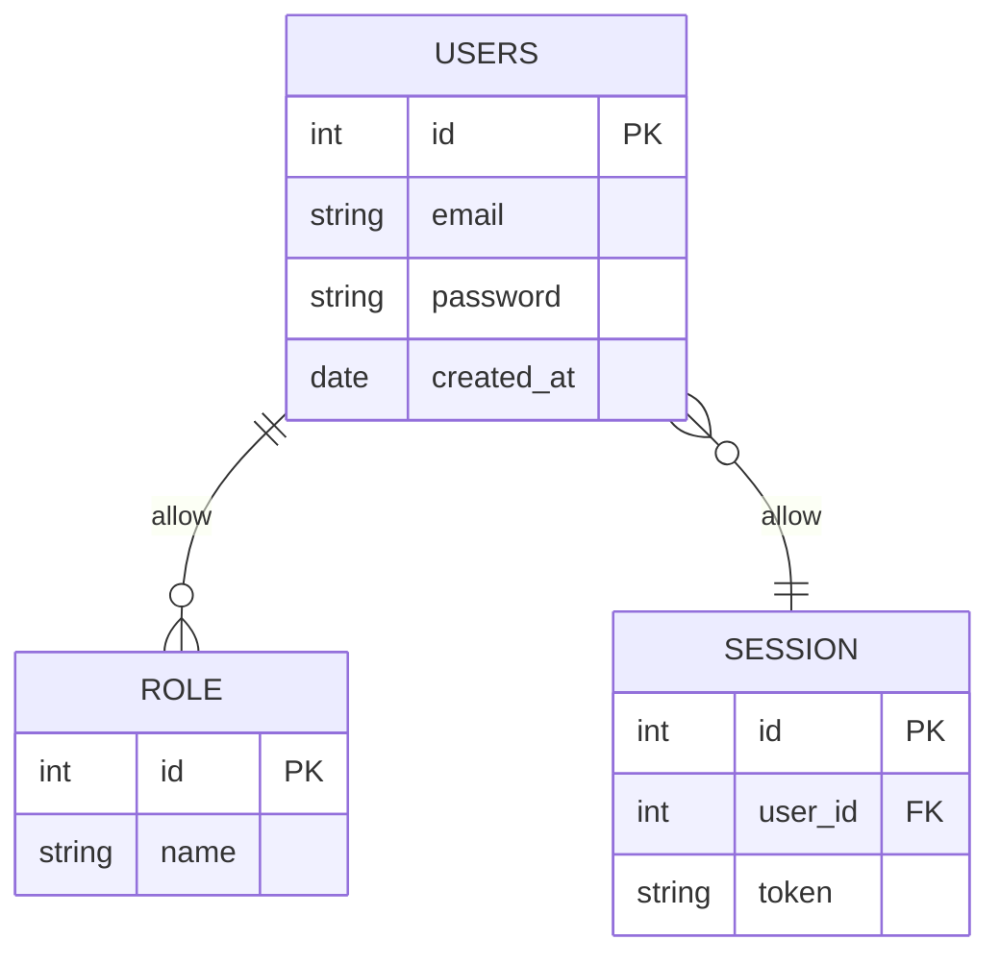

```mermaid

erDiagram

USERS ||--o{ ROLE : allow
USERS }o--|| SESSION : allow
USERS{
  int id PK
  string email
  string password
  date created_at
}

ROLE{
  int id PK
  string name
}

SESSION{
  int id PK
  int user_id FK
  string token
}

```
