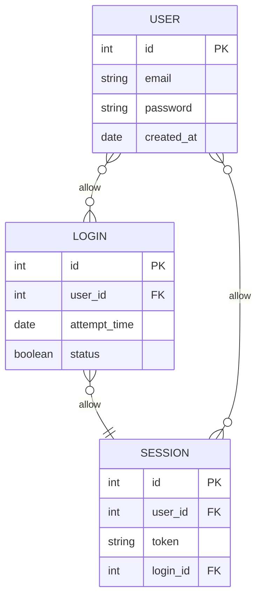

```mermaid

erDiagram

USER }o--o{ LOGIN : allow
USER{
  int id PK
  string email
  string password
  date created_at
}

LOGIN }o--|| SESSION : allow
LOGIN{
  int id PK
  int user_id FK
  date attempt_time
  boolean status
}

SESSION }o--o{ USER : allow
SESSION{
  int id PK
  int user_id FK
  string token
  int login_id FK
}

```
