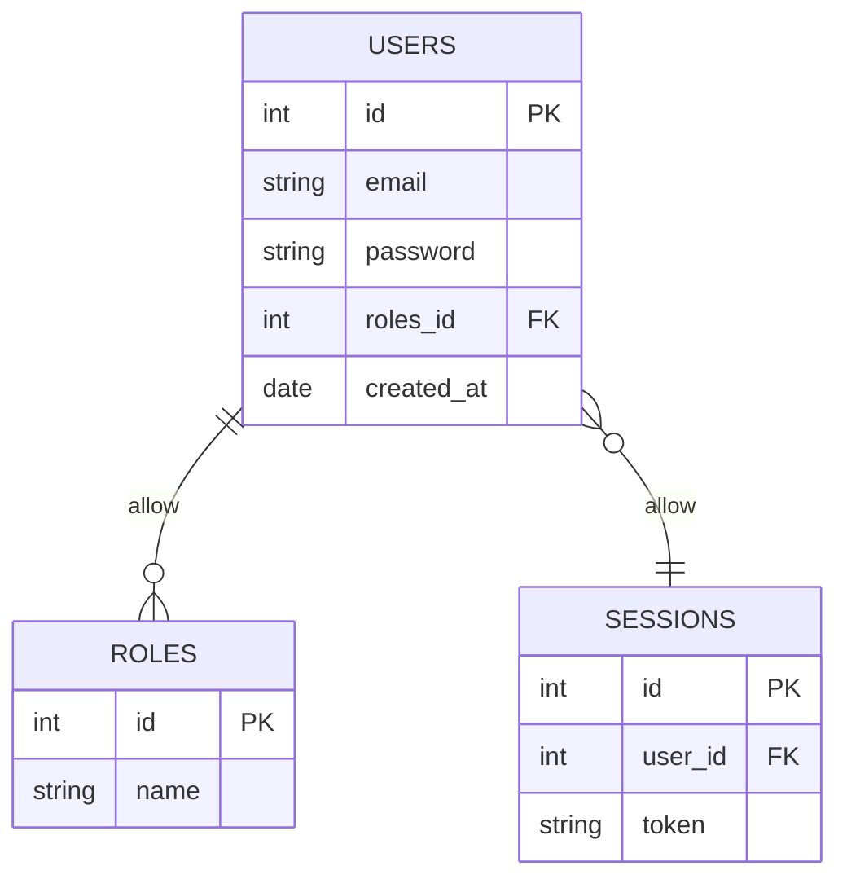

```mermaid

erDiagram

USERS ||--o{ ROLES : allow
USERS }o--|| SESSIONS : allow
USERS{
  int id PK
  string email
  string password
  int roles_id FK
  date created_at
}

ROLES{
  int id PK
  string name
}

SESSIONS{
  int id PK
  int user_id FK
  string token
}

```
